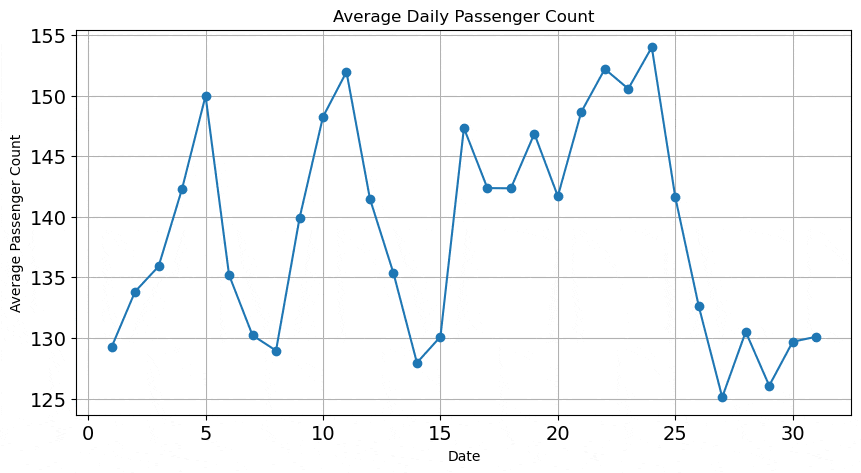

# High-Speed Rail Passenger Demand Forecast

---

## Overview

This project builds a **hybrid time series forecasting model** that blends the strengths of:
- **Seasonal AutoRegressive Integrated Moving Average with eXogenous regressors (SARIMAX)** (for trend and seasonality)
- **Bi-Directional Gated Recurrent Unit (BiGRU)** (for complex, non-linear patterns)

It is designed to assist Unicorn Ventures in making an informed decision regarding their investment in JetRail by forecasting passenger traffic for the next 7 months, providing critical insights into the growth potential and demand trends.

---

## Topics

transportation | time-series | passenger-forecasting | SARIMAX | BiGRU | forecasting-pipeline | deep-learning | RNN | seasonality | ridership

---

## Training Pipeline

The following flowchart outlines the hybrid training pipeline:

---

## Table of Contents
- [Overview](#overview)
- [Topics](#topics)
- [Training Pipeline](#training-pipeline)
- [Data Source](#data-source)
- [Key Findings](#key-findings)
- [Models Comparison](#models-comparison)
- [Forecast Snapshots](#forecast-snapshots)
- [Project Structure](#project-structure)
- [Future Work](#future-work)

---

## Data Source

 The data for this problem is provided through the competition hosted on [Analytics Vidhya ](https://www.analyticsvidhya.com/datahack/contest/practice-problem-time-series-2/#ProblemStatement)

---

## Key Findings

- Passenger counts show strong growth from 2012 to 2014, with peak usage in 2014.  
- Demand follows workweek patterns: high on weekdays, especially at rush hours  (6AM–11AM to midnight and again from evening to midnight), and low on weekends.  
- Monthly and seasonal patterns indicate cyclical trends, with higher summer demand likely due to tourism.  
- Among classical models, **Holt Linear** (lowest RMSE) and **SES** (lowest MAPE) perform best.  
- **SARIMAX** is the top classical model (RMSE: 70.65, MAPE: 13.18%).  
- **BiGRU** performs second-best overall (RMSE: 75.40, MAPE: 15.15%).  
- **Hybrid model** (SARIMAX + BiGRU) outperforms all others (RMSE: 74.09, MAPE: 11.43%).  
- The hybrid forecast for 210 days reflects realistic seasonal trends and weekly cycles.

---

## Forecast Snapshots  

 
 - `EDA Output/`: Visual exploration of time series patterns.

---

 
- `210 Days Forecast/`: Forecasts from July 2014 to Jan 2015, showcasing weekly and seasonal effects.

---

##  Models Comparison

| Model              | RMSE     | MAPE     | Remark |
|-------------------|----------|----------|-------|
| Naïve              | 116.07   | 21.80%  | Baseline |
| Moving Average     | 125.41 | 22.09%    | Averaging out short-term fluctuations  | 
| SES                | 114.93   | 22.00%   | Simple smoothing |
| Holt Linear        | 105.92   | 26.84%   | Captures trend |
| Holt-Winters       | 111.59   | 22.81%   | Adds seasonality |
| ARIMA              | 115.77   | 22.20%   | Basic autoregression |
| SARIMAX            | 70.65    | 13.18%   | Strong seasonality capture |
| BiGRU              | 75.40    | 15.15%   | Learns nonlinear patterns |
| **Hybrid**         | **74.09**| **11.43%** | ✅ **Best overall performance** |


---

## Project Structure

```bash
├── data/              # Raw and processed data
├── notebooks/         # Exploratory analysis and model dev
├── src/               # Model scripts
│   ├── sarimax_model.py
│   ├── bigru_model.py
│   └── hybrid_model.py
├── assets/           # Plots, predictions, metrics
├── requirements.txt
└── README.md
```

---

## Future Work

- Add external regressors (events, weather, holidays)
- Quantile forecasts for uncertainty estimation
- Deploy model via REST API or dashboard


